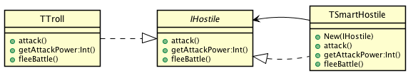

# Decorator

## Also known as
Wrapper

## Intent
Attach additional responsibilities to an object dynamically.
Decorators provide a flexible alternative to subclassing for extending
functionality.

## Applicability
Use Decorator

* to add responsibilities to individual objects dynamically and transparently, that is, without affecting other objects
* for responsibilities that can be withdrawn
* when extension by subclassing is impractical. Sometimes a large number of independent extensions are possible and would produce an explosion of subclasses to support every combination. Or a class definition may be hidden or otherwise unavailable for subclassing

## Credits

* [Design Patterns: Elements of Reusable Object-Oriented Software](http://www.amazon.co.uk/Design-Patterns-Elements-Reusable-Object-Oriented/dp/0201633612)
* [Functional Programming in Java: Harnessing the Power of Java 8 Lambda Expressions](http://www.amazon.co.uk/Functional-Programming-Java-Harnessing-Expressions/dp/1937785467)
* [J2EE Design Patterns](http://www.amazon.co.uk/J2EE-Design-Patterns-William-Crawford/dp/0596004273)
