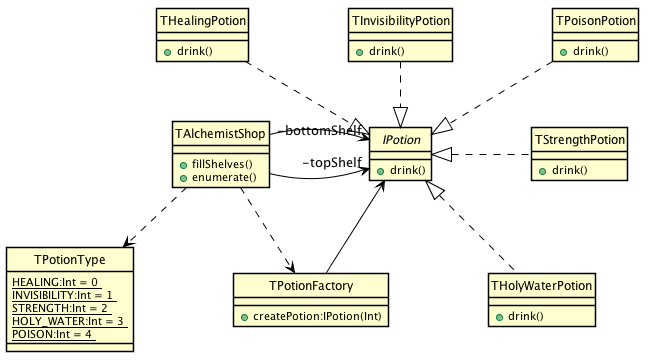

# Flyweight

## Intent
Use sharing to support large numbers of fine-grained objects
efficiently.

## Applicability
The Flyweight pattern's effectiveness depends heavily on how
and where it's used. Apply the Flyweight pattern when all of the following are
true

* an application uses a large number of objects
* storage costs are high because of the sheer quantity of objects
* most object state can be made extrinsic
* many groups of objects may be replaced by relatively few shared objects once extrinsic state is removed
* the application doesn't depend on object identity. Since flyweight objects may be shared, identity tests will return true for conceptually distinct objects.

## Credits

* [Design Patterns: Elements of Reusable Object-Oriented Software](http://www.amazon.co.uk/Design-Patterns-Elements-Reusable-Object-Oriented/dp/0201633612)
