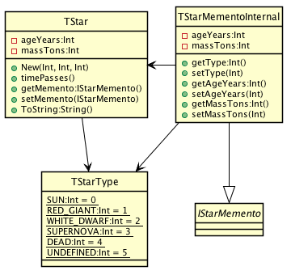

# Memento

## Also known as
Token

## Intent
Without violating encapsulation, capture and externalize an
object's internal state so that the object can be restored to this state later.

## Applicability
Use the Memento pattern when

* a snapshot of an object's state must be saved so that it can be restored to that state later, and
* a direct interface to obtaining the state would expose implementation details and break the object's encapsulation

## Credits

* [Design Patterns: Elements of Reusable Object-Oriented Software](http://www.amazon.co.uk/Design-Patterns-Elements-Reusable-Object-Oriented/dp/0201633612)
