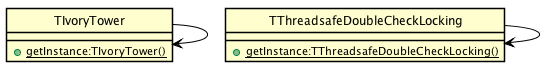

# Singleton

## Intent
Ensure a class only has one instance, and provide a global point of
access to it.

## Applicability
Use the Singleton pattern when

* there must be exactly one instance of a class, and it must be accessible to clients from a well-known access point
* when the sole instance should be extensible by subclassing, and clients should be able to use an extended instance without modifying their code

## Typical Use Case

* the logging class
* managing a connection to a database
* file manager

## Consequences

* Violates Single Responsibility Principle (SRP) by controlling their own creation and lifecycle.
* Encourages using a global shared instance which prevents an object and resources used by this object from being deallocated.     
* Creates tightly coupled code that is difficult to test.
* Makes it almost impossible to subclass a Singleton.

## Credits

* [Design Patterns: Elements of Reusable Object-Oriented Software](http://www.amazon.co.uk/Design-Patterns-Elements-Reusable-Object-Oriented/dp/0201633612)
* [Effective Java (2nd Edition)](http://www.amazon.co.uk/Effective-Java-Edition-Joshua-Bloch/dp/0321356683)
